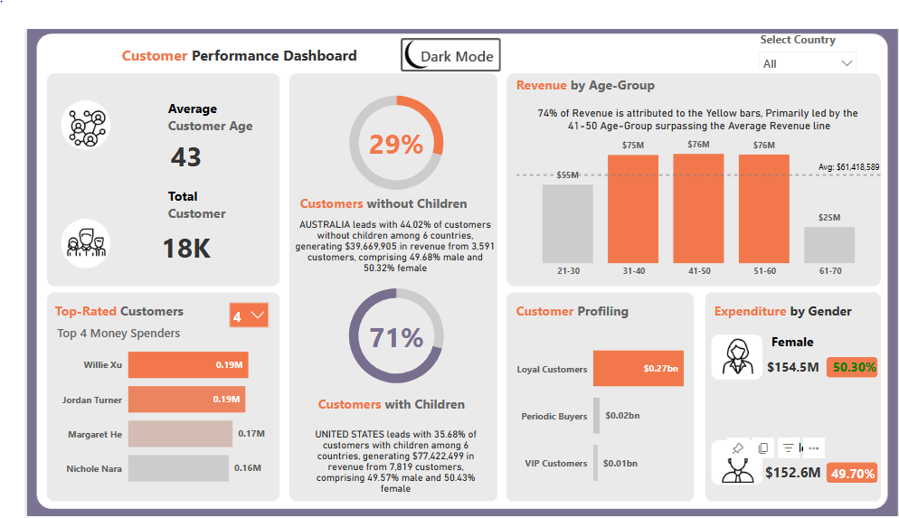

# Introduction

The marketing Department of Maverick Household supplies are looking to gain valuable customer information to base their next year campaign on. They are looking to enter a new geography and would like to know the demography of its customer.

### Problem statement

As a Data Analyst, I was tasked to analyze their customer performance data for the previous year and come up with insights that would shed more light on the customers profile breakdown.
>
I was asked to produced Metrics like Top Money Spenders, Percentage of customers with and without children, age brackek(group) of customers, Expenditure by Gender, customers profiling
>
### Skills and concept demonstration

Data cleaning, powerQuery Functions, Data Transformation, Data Modeling Data analysis & visualization
#### Data Cleansing and Transformation

The Dataset was loaded to power-query and the following activities took place
- The tables were properly named to ensure easy identification.
- Wrong Data types were corrected
- All Typo Errors were corrected
- Columns that were not necessary to the analysis were removed
>
The customer performance dataset contains 5 tables which include DImSaleTerritory, DimProduct, DimGeography, DimCustomer and SalesFacttable
>
#### Data Modeling
>
The Data Model follows the usual Star Schema. All Dimensional table were connected to the Salesfact table, creating a one to many relationship between the Dimension table and the fact table.
Several of DAX measures were created such as the % of customers with children, % of customer without children, Average Customer Age, 
The Data Modeling was done to connect related tables together.
>
### Data Visualization and Insights

- The three dominant purchasing Age-groups 31-40, 41-50, 51-60 these Age groups contribute 74% of the Total Revenue
- The female gender slightly edges the male gender on  Expenditure, with the female contributing 50.30% while the male contributed 49.70%
- Customers with children make up 71% of the total customers while customers without children make up 29%.
- Willie XU and Jordan Turner tie the knot as the top-rated customer  with both an expenditure of 0.19M
>
### Recommendation
>
The loyal customers contributed $270m which represents about 80% of the total revenue. Efforts must continue to be made to convert new customers to loyal customers

